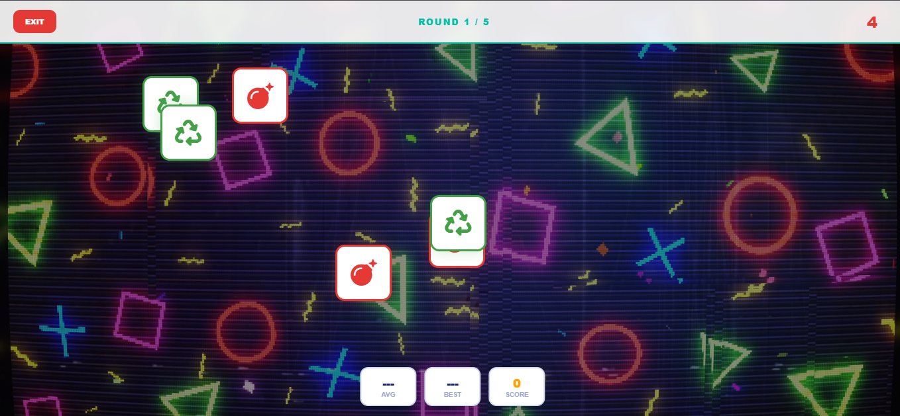
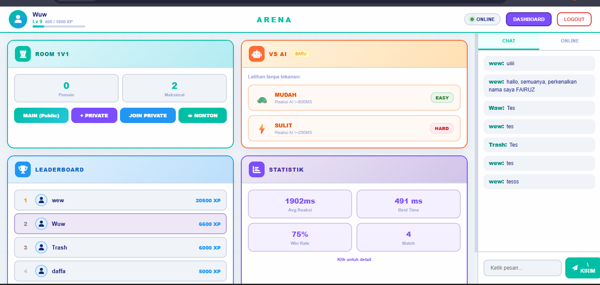
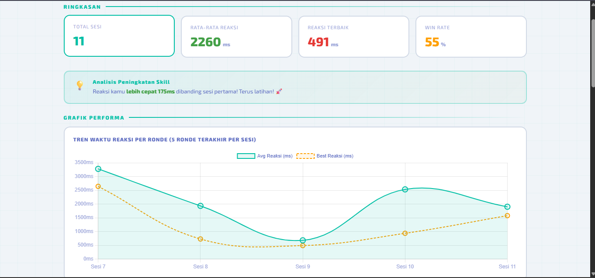

# Reaction Time Challenge - [CLoud Computing]

## Anggota Kelompok

| Nama | NPM | Peran |
| :--- | :--- | :--- |
| Muhammad Fairuz Nadhir Amrullah | [2410010083] | [ Frontend Developer (UI/UX, Tailwind CSS, Websocket CLient]
| Muhammad Adam Yazid Bustami | 2410010113] | [ Database Developer & Data Engineer]
| Muhammad Daffa Fadillah | 2410010114 | Backend Architecture & Backend]
| Muhammad Ridho Jan Muhani | 2410010567 | Data Analyst (Dashboard Analitik, menganalisis data, mencari pola)]

## Link Penting
* **Video Demo: https://youtu.be/xRSJab0926o
* **Proposal:** [proposal.pdf](PROPOSAL_PENGEMBANGAN_GAME.pdf)
* **Laporan Akhir:** [laporan_akhir.pdf](laporan_akhir_Reaction_Duel.pdf)
* **Slide Presentasi:** [slide_presentasi.pptx](Reaction_Duel_presentasi.pptx)

## Teknologi yang Digunakan
* PHP
* JavaScript
* MySQL

## Screenshot Sistem

